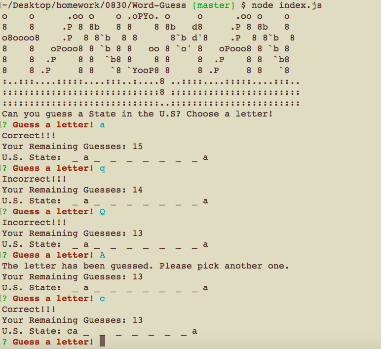

# Word-Guess
Assignment_Word-Guess.


# Link to deployed site
https://lalatw.github.io/Word-Guess/


# Images
 

# Technology used
* javascript
* node.js
* Require
* Inquirer
* Constructor


# Instruction and npm Install
* You'll need to run the program in Terminal/Bash using command-line.
* Please run npm Install for package needed.
* Please run "index.js" to start playing the game.

```
  "dependencies": {
    "inquirer": "^6.2.0"
  }
```

# Code snippets

 


# Learning points
* Apply Node.js to run backend and executes JavaScript code outside of a browser. 
* Apply constructor function to create objects to be across-referenced in the program.
* Run npm install to use pre-built packages of modules.
* Use Require to grab data from sources.


# Author 
[Shuhan Laura Lee](https://lalatw.github.io/Word-Guess/)


# License
Standard MIT License
